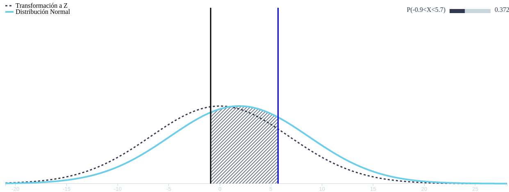
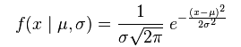

Esta es una aplicación resarrollada con la ayuda de d3.js, Angular.js y simple_statistic.js, para la representación de la distribución normal.

El área bajo la campana de Gauss representa la probabilidad de ocurrencia de un suceso. La curva esta dada por la siguiente expresión.

Gracias a esta representación puedes ver y manipular las variables para ver los cambios de probabilidad. ( Mueve los Sliders para ver los cambios)

<!-- end -->
<iframe width="100%" height="300" src="//jsfiddle.net/camilortte/k4z5e1hm/17/embedded/result/dark/" allowfullscreen="allowfullscreen" allowpaymentrequest frameborder="0"></iframe>

     
Sí quieres conocer más sobre Distribución Normal en <a href="https://en.wikipedia.org/wiki/Normal_distribution">Wikipedia</a>  la encuentras.

Sí quieres ver el código fuente lo puedes hacer en mi perfil de <a href="https://github.com/camilortte/normalDistributionAngular">GitHub</a>. 

Sí tienes algúna duda o pregunta comenta ;).

Saludos.
